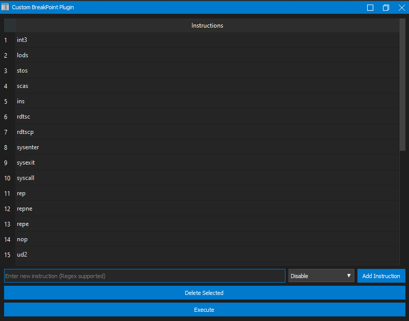

# Custom Breakpoint Setter
This is an IDA Plugin powered by Python that sets a disabled breakpoint on specific instruction's mnemonic.

# Installation

Just copy the python script into `$ida_path/plugins/` and restart your IDA.

# DEMO

[demo.webm](https://github.com/Reodus/CBS/assets/161498863/d9da43ee-36a5-45d3-8f9a-eec69ff4f603)
